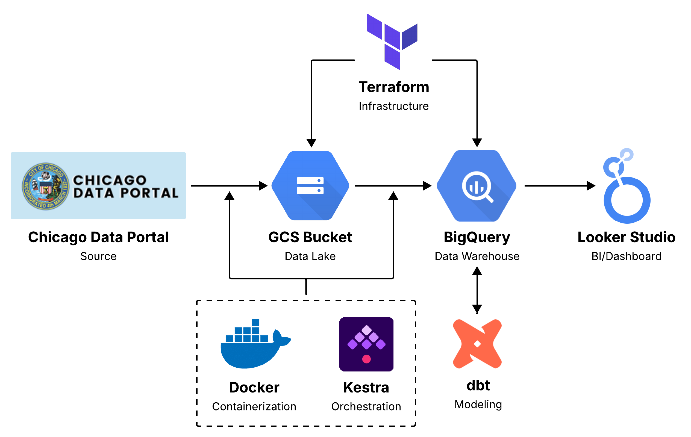
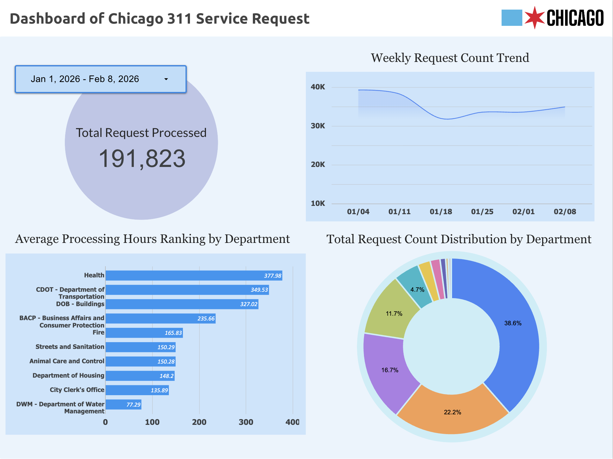

# Chicago 311 Service Requests Pipeline
## Introduction
A Google Cloud Platform data pipeline using Kestra orchestration (Docker Containerized), Terraform (IaC), GCS Bucket, BigQuery, dbt, and Looker Studio. The project processes Chicago 311 Service Request data beginning in January 2026. The system demonstrates a ELT architecture: 
API ingestion → Data lake → Data warehouse → Transformation → BI visualization.

## Architecture & Dashboard Overview

[Link to the Dashboard](https://lookerstudio.google.com/reporting/43f750f9-0537-4fd7-b4a3-f7c0138d32b3)

## Data Source
The dataset of this project is [Chicago 311 Service Requests](https://data.cityofchicago.org/Service-Requests/311-Service-Requests/v6vf-nfxy/about_data) from Chicago Data Portal. The data is continuously updated, making it suitable for incremental design. In this project, Socrata Open Data API (SODA) is implemented for data extraction into the data lake.

## Infrastracture
Infrastracture resources in the project are provisioned using Terraform (IaC Tool), including:
 - A GCS bucket used as the data lake
 - A BigQuery dataset used for storing ingested records

### Data Lake (GCS Bucket)
Raw data extracted from the Socrata API is stored in Google Cloud Storage. The bucket acts as the raw ingestion layer of the pipeline.

Example storage structure: [TO BE UPDATED]

### Data Warehouse (Google BigQuery)
BigQuery serves as the analytical warehouse for the project. 

## Workflow Orchestration (Kestra + Docker)
### Historical Full Load
### Incremental Load (Watermark-based)

## Transformation & Modeling (dbt Cloud)
dbt is used to transform raw warehouse tables into analytics-ready models.

### Source Layer
Raw data is pulled from the warehouse (BigQuery) table.

### Staging Layer
The staging model performs schema normalization and feature preparation including:
 - Explicit type casting
 - Column renaming
 - Timestamp parsing

### Mart Layer
The mart layer builds aggregated tables for BI analysis.
 - Counts requests by day of week and hour of day
 - Aggregates number of requests handled by each department and average processing hours
 - Identifies the top 10 most frequent request categories
 - Calculates total requests by week to track temporal trends

## Visualization (Google Looker Studio)
The dashboard layer is built using Google Looker Studio. It connects directly to BigQuery dbt mart tables.